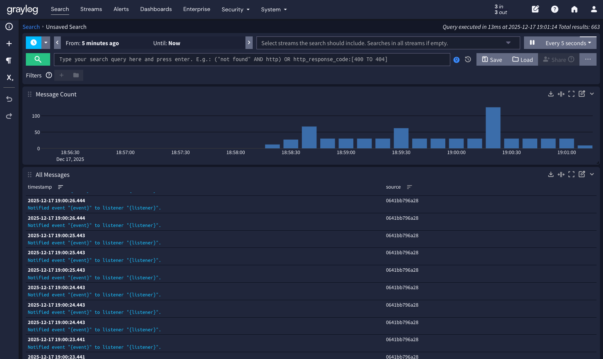
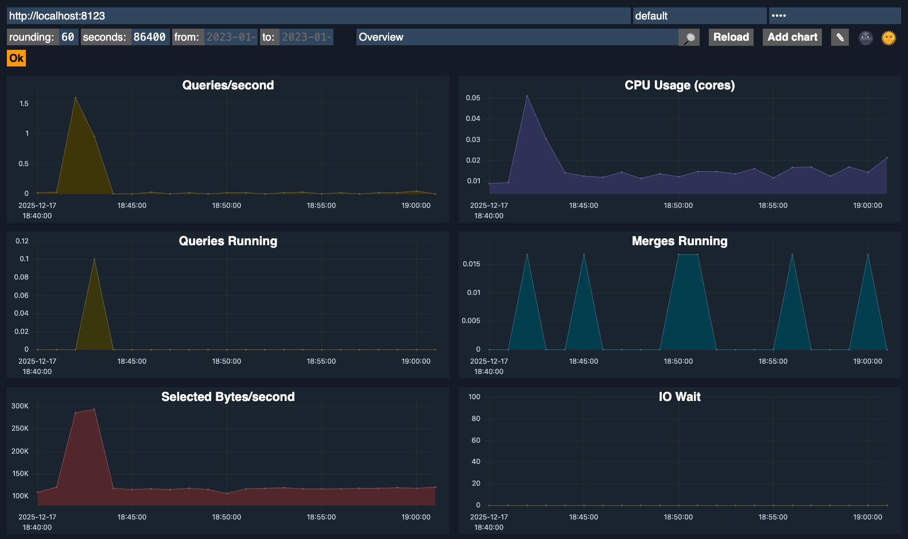
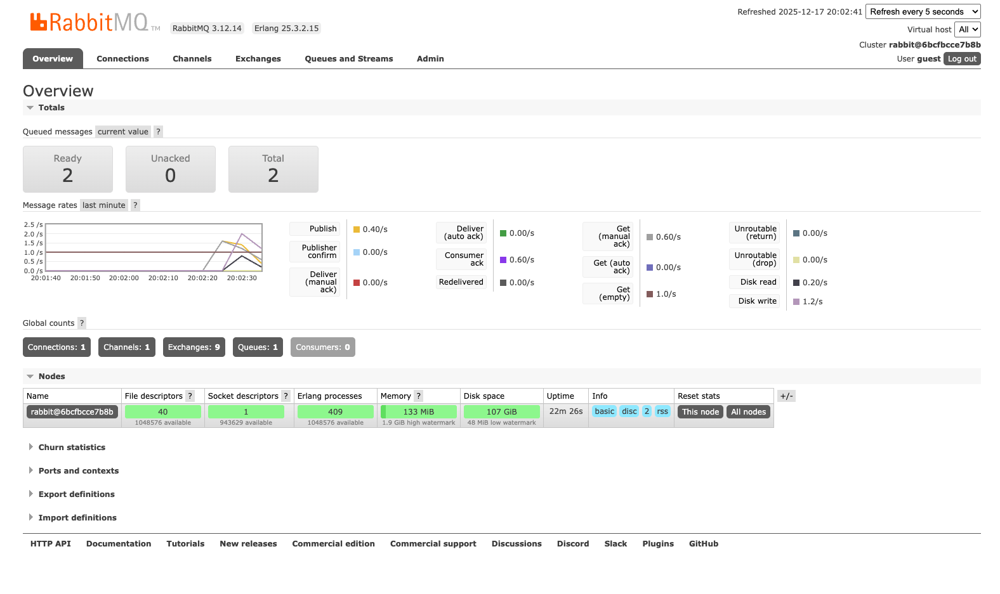

# Symfony Event Stream Analyzer

### App Stack
 - PHP: 8.3
 - Symfony: 6.4
 - Docker
 - Docker Compose
 - RabbitMQ
 - ClickHouse
 - Graylog

## Services
Graylog: http://localhost:9000/welcome


ClickHouse: http://localhost:8123/dashboard


RabbitMq: http://localhost:15672


## Generate Event
query
```bash
curl --location 'http://localhost/api/event/dispatch' \
  --header 'Content-Type: application/json' \
  --data '{"type": "new_order", "payload": {"user_id": 123, "amount": 99.99}}'
```
response
```json
{
  "status": "accepted",
  "message": "Event dispatched to RabbitMQ",
  "id": "693eba0ae8074"
}
```

## ElasticSearch Results
query
```bash
curl --location 'http://localhost/api/search/events?q=new_order'
```
response
```json
{
  "total": 1,
  "events": [
    {
      "id": "1",
      "score": 0.2876821,
      "type": "new_order",
      "indexed_at": "2025-12-14T13:22:18+00:00"
    }
  ]
}
```

## ClickHouse Events
query
```bash
curl --location 'http://localhost/api/analytics/summary'
```
response
```json
{
  "source": "ClickHouse",
  "description": "Event counts by type over the last 7 days.",
  "results": {
    "2025-12-14 00:00:00": {
      "new_order": 1
    }
  }
}
```

# SetUp App
```bash
docker-compose up -d --build
docker-compose exec app php bin/console doctrine:migrations:migrate --no-interaction
docker-compose exec app php bin/console app:clickhouse:setup 
docker-compose exec app php bin/console messenger:consume events -vv
```